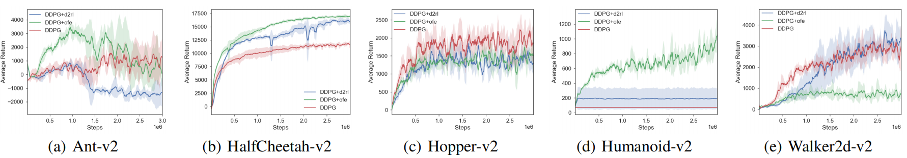
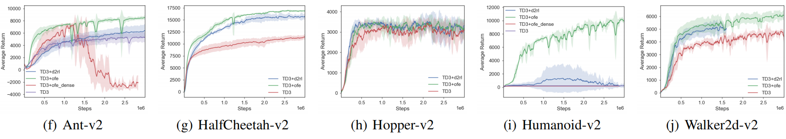
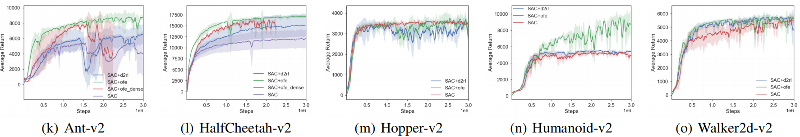
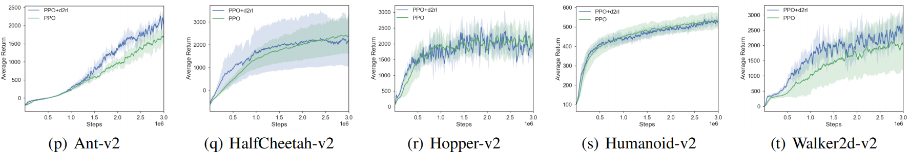

## Deeper and Larger Network Design for Continous Control in RL
Implementation of large network design in RL. Easy switch between toy tasks and challenging games. Mainly follow three recent papers:

- 2020 ICML [Can Increasing Input Dimensionality Improve Deep Reinforcement Learning?](https://arxiv.org/abs/2003.01629)
- 2020 NeurIPS Workshop [D2RL: Deep Dense Architectures in Reinforcement Learning](https://arxiv.org/abs/2010.09163) 
- 2021 Arxiv [Training Larger Networks for Deep Reinforcement Learning](https://arxiv.org/abs/2102.07920)

In the code, we denote the method in [Can Increasing Input Dimensionality Improve Deep Reinforcement Learning?](https://arxiv.org/abs/2003.01629) as `ofe`, the method in [D2RL: Deep Dense Architectures in Reinforcement Learning](https://arxiv.org/abs/2010.09163) as `d2rl`, and the method in [Training Larger Networks for Deep Reinforcement Learning](https://arxiv.org/abs/2102.07920) as `ofe_dense`. It is noteworthing that we only implement single-machine approach for `ofe_dense`, and we observe the **overfitting phenomenon**. We speculate that this is because the single-machine version is not as stable as the distributed approach.


### Supported algorithms
| algorithm | continuous control | on-policy / off-policy |
|:-|:-:|:-:|
| [Proximal Policy Optimization (PPO)](https://arxiv.org/abs/1707.06347) coupled with [d2rl](https://arxiv.org/abs/2010.09163)| :white_check_mark: | *on-policy* | 
| [Deep Deterministic Policy Gradients (DDPG)](https://arxiv.org/abs/1509.02971) coupled with [d2rl](https://arxiv.org/abs/2010.09163) | :white_check_mark: | *off-policy* |
| [Deep Deterministic Policy Gradients (DDPG)](https://arxiv.org/abs/1509.02971) coupled with [ofe](https://arxiv.org/abs/2003.01629) | :white_check_mark: | *off-policy* |
| [Deep Deterministic Policy Gradients (DDPG)](https://arxiv.org/abs/1509.02971) coupled with [ofe_dense](https://arxiv.org/abs/2102.07920) | :white_check_mark: | *off-policy* |
| [Twin Delayed Deep Deterministic Policy Gradients (TD3)](https://arxiv.org/abs/1802.09477) coupled with [d2rl](https://arxiv.org/abs/2010.09163)| :white_check_mark: | *off-policy* |
| [Twin Delayed Deep Deterministic Policy Gradients (TD3)](https://arxiv.org/abs/1802.09477) coupled with [ofe](https://arxiv.org/abs/2003.01629)  | :white_check_mark: | *off-policy* |
| [Twin Delayed Deep Deterministic Policy Gradients (TD3)](https://arxiv.org/abs/1802.09477) coupled with [ofe_dense](https://arxiv.org/abs/2102.07920) | :white_check_mark: | *off-policy* |
| [Soft Actor-Critic (SAC)](https://arxiv.org/abs/1812.05905) coupled with [d2rl](https://arxiv.org/abs/2010.09163) | :white_check_mark: |*off-policy* | 
| [Soft Actor-Critic (SAC)](https://arxiv.org/abs/1812.05905) coupled with [ofe](https://arxiv.org/abs/2003.01629)| :white_check_mark: |*off-policy* | 
| [Soft Actor-Critic (SAC)](https://arxiv.org/abs/1812.05905) coupled with [ofe_dense](https://arxiv.org/abs/2102.07920) | :white_check_mark: |*off-policy* | 

## Instructions
### Recommend: Run with Docker
```bash
# python        3.6    (apt)
# pytorch       1.4.0  (pip)
# tensorflow    1.14.0 (pip)
# DMC Control Suite and MuJoCo
cd dockerfiles
docker build . -t rl-docker
```
For other dockerfiles, you can go to [RL Dockefiles](https://github.com/LQNew/Dockerfiles).

### Launch experiments
Run with the scripts `batch_run_main_d2rl_4seed_cuda.sh` / `batch_run_main_ofe_4seed_cuda.sh` / `batch_run_main_ofe_dense_4seed_cuda.sh` / `batch_run_ppo_d2rl_4seed_cuda.sh`:
```bash
# eg.
bash batch_run_main_ofe_4seed_cuda.sh Ant-v2 TD3_ofe 0 True # env_name: Ant-v2, algorithm: TD3_ofe, CUDA_Num: 0, layer_norm: True

bash batch_run_ppo_d2rl_4seed_cuda.sh Ant-v2 PPO_d2rl 0 # env_name: Ant-v2, algorithm: PPO_d2rl, CUDA_Num: 0
```

### Plot results
```bash
# eg. Notice: `-l` denotes labels, `data/DDPG-Hopper-v2/` represents the collecting dataset, 
# and `-s` represents smoothing value.
python spinupUtils/plot.py \
    data/DDPG_ofe-Hopper-v2/ \
    -l DDPG_ofe -s 10
```

### Performance on MuJoCo
Including `Ant-v2`, `HalfCheetah-v2`, `Hopper-v2`, `Humanoid-v2`, `Walker2d-v2`.

- DDPG and its variants
  

- TD3 and its variants
  

- SAC and its variants
  

- PPO and its variants
  

### Citation
```bash
@misc{QingLi2021larger,
  author = {Qing Li},
  title = {Deeper and Larger Network Design for Continous Control in RL},
  year = {2021},
  publisher = {GitHub},
  journal = {GitHub repository},
  howpublished = {\url{https://github.com/LQNew/Deeper_Larger_Actor-Critic_RL}}
}
```
